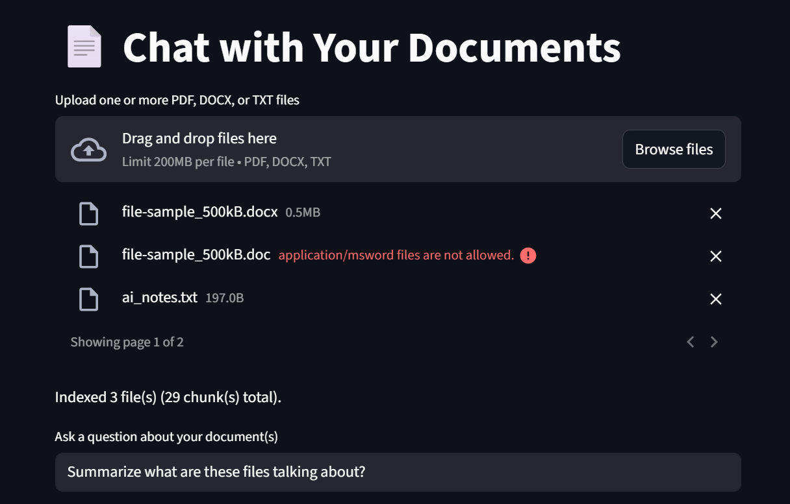

# Document-RAG-Assistant

RAG Q&A over **PDF, DOCX, and TXT** (Streamlit) plus PDF-oriented scripts in `code/`.


---

## Overview

**Document-RAG-Assistant** is a Retrieval-Augmented Generation (RAG) assistant that answers questions from **PDF, DOCX, and TXT** files (via the Streamlit app), with additional PDF-focused scripts under `code/`.  
It uses:

- **OpenAI embeddings** to convert text into numerical vectors
- **Chroma** to store and retrieve document embeddings
- **Streamlit** for interactive multi-file upload and Q&A
- **Vector database caching** in the CLI scripts to avoid repeated embedding work

This project demonstrates **real-world AI system design** and is structured for modularity and reusability.

---

## Project Structure

```
Document-RAG-Assistant/
│
├── app/                     # Streamlit UI: PDF, DOCX, TXT upload and Q&A
├── code/                    # Python scripts
│   ├── rag_engine.py        # Embeddings, retrieval, answer generation
│   ├── rag_document_assistant.py
│   ├── pdf_rag_assistant.py
│   └── pdf_rag_chroma.py
├── docs/                    # Screenshots for README
│   ├── TalkWithYourDocsNewScreenShot.png
│   ├── upload_ui.png
│   └── qa_example.png
├── documents/               # Sample PDF or text documents
├── README.md
├── requirements.txt
└── .gitignore
```

---

## Setup Instructions

1. **Install Python 3.12+**  
2. **Create virtual environment**:

```powershell
python -m venv ai-env
```

If you have multiple Python versions installed, use the 3.12+ executable explicitly:

```powershell
python3.12 -m venv ai-env
# or
python3.13 -m venv ai-env
```

3. **Activate environment**:

```powershell
# Windows PowerShell
Set-ExecutionPolicy -Scope Process -ExecutionPolicy Bypass
. .\ai-env\Scripts\Activate.ps1

# Or Windows CMD
ai-env\Scripts\activate.bat
```

4. **Install dependencies** (includes `pdfplumber`, `python-docx` for DOCX, `streamlit`, `chromadb`, etc.):

```powershell
python -m pip install --upgrade pip
pip install -r requirements.txt
```

5. **Verify the virtual environment Python version**:

```powershell
python --version
```

It must show `Python 3.12+` while the virtual environment is active. If it shows `Python 3.9.x`, the env was created with the wrong interpreter and must be recreated with Python 3.12+.

6. **Create `.env` file** in the project root and add your OpenAI key:

```bash
OPENAI_API_KEY=your_openai_api_key_here
```

7. **Place PDF or text documents** in `documents/` folder.

> Note: Use the same virtual environment when you run the app. If `streamlit` is not found, run:
>
> ```powershell
> python -m streamlit run app/streamlit_app.py
> ```
>
> If you get an OpenAI API key error, check that the `.env` file is in the repo root and contains exactly:
>
> ```bash
> OPENAI_API_KEY=your_openai_api_key_here
> ```
>
> In PowerShell, you can also set the variable manually for the current session:
>
> ```powershell
> $env:OPENAI_API_KEY = 'your_openai_api_key_here'
> python -m streamlit run app/streamlit_app.py
> ```

---

## Usage

### RAG Document Assistant

`rag_document_assistant.py` demonstrates a basic RAG pipeline.

- Loads documents
- Converts them into embeddings
- Retrieves the most relevant document for a question using cosine similarity
- Generates an answer using OpenAI

### PDF Document Assistant

`pdf_rag_assistant.py` demonstrates a RAG pipeline for PDF documents.

- Extracts text from a PDF
- Splits text into chunks
- Generates embeddings and stores them in **Chroma vector database**
- Retrieves relevant chunks and generates answers
- **Vector database caching** avoids repeated embeddings for faster runs

### PDF RAG Chroma Assistant

`pdf_rag_chroma.py` is an enhanced version:

- Reads PDFs
- Splits into chunks
- Stores embeddings in **persistent ChromaDB**
- Reuses embeddings if already present
- Optimized for speed and cost
- Shows modular design calling functions from `rag_engine.py`

### Streamlit App

The `app/` folder contains a Streamlit app (`streamlit_app.py`):

- Interactive web interface for uploading **one or more PDF, DOCX, or TXT** files at once
- Text is chunked per file with `[Source: filename]` so answers can be grounded in the right document
- DOCX ingestion includes paragraphs and table cell text; TXT is read as UTF-8 (invalid bytes replaced)
- Ask questions across all indexed documents in real time
- Uses embeddings + Chroma retrieval (`user_documents` collection) and OpenAI for answers  
- If `python-docx` is missing, PDF and TXT still work; uploading a DOCX shows an install hint in the UI

Run the Streamlit app with:

```bash

```

---

## Demo

### Streamlit app (PDF, DOCX, TXT)



---

## Key Features

- Modular RAG engine (`rag_engine.py`)  
- PDF ingestion and text chunking  
- **Multi-file upload** (PDF, DOCX, TXT) in the Streamlit UI with per-file source labels in chunks  
- Embedding generation and caching  
- Persistent vector database (ChromaDB)  
- Streamlit web UI for interactive questions  
- Portfolio-ready structure for recruiters and engineers

---

## Notes

- Make sure `.env` contains your **OpenAI API key**  
- Do not commit `.env` or `ai-env/` to GitHub  
- **DOCX** requires the `python-docx` package (listed in `requirements.txt`); legacy `.doc` is not supported  
- Requires Python 3.12+ to run `pdf_rag_chroma.py` due to SQLite version requirements  
- **Project name vs GitHub:** this repo is branded **Document-RAG-Assistant**. If your remote is still `PDF-RAG-Assistant`, either rename the repository on GitHub or change the four `shields.io` URLs above so the slug matches your repo.  

---

## Future Improvements

- Persist Chroma data across Streamlit sessions and avoid re-embedding on every rerun  
- Add user authentication and cloud deployment  
- Refine citation UX for retrieved chunks and make source context easier to inspect

