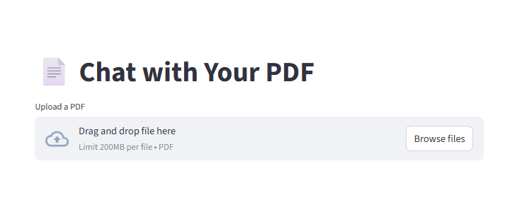
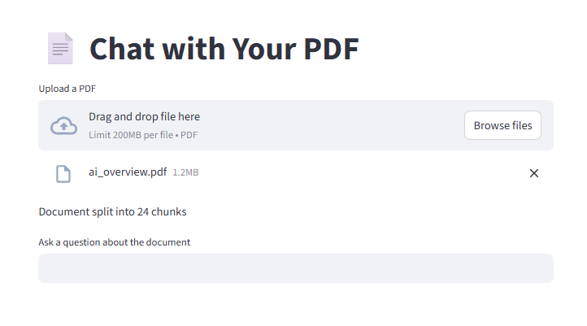

# PDF-RAG-Assistant


---

## Overview

**PDF-RAG-Assistant** is a Retrieval-Augmented Generation (RAG) AI assistant that can answer questions about PDF documents.  
It uses:

- **OpenAI embeddings** to convert text into numerical vectors
- **Chroma vector database** to store and retrieve document embeddings efficiently
- **Streamlit** web interface for interactive Q&A
- **Vector database caching** to avoid repeated embedding generation

This project demonstrates **real-world AI system design** and is structured for modularity and reusability.

---

## Project Structure

```
OpenAi-Public/
│
├── app/                     # Streamlit web UI for interactive PDF Q&A
├── code/                    # Python scripts
│   ├── rag_engine.py        # Embeddings, retrieval, answer generation
│   ├── rag_document_assistant.py
│   ├── pdf_rag_assistant.py
│   └── pdf_rag_chroma.py
├── docs/                    # Screenshots for README
│   ├── upload_ui.png
│   └── qa_example.png
├── documents/               # Sample PDF or text documents
├── README.md
├── requirements.txt
└── .gitignore
```

---

## Setup Instructions

1. **Install Python 3.12+**  
2. **Create virtual environment**:

```bash
python -m venv ai-env
```

3. **Activate environment**:

```bash
# Windows
ai-env\Scripts\activate
```

4. **Install dependencies**:

```bash
pip install --upgrade pip
pip install -r requirements.txt
```

5. **Create `.env` file** in the project root and add your OpenAI key:

```bash
OPENAI_API_KEY=your_openai_api_key_here
```

6. **Place PDF or text documents** in `documents/` folder.

---

## Usage

### RAG Document Assistant

`rag_document_assistant.py` demonstrates a basic RAG pipeline.

- Loads documents
- Converts them into embeddings
- Retrieves the most relevant document for a question using cosine similarity
- Generates an answer using OpenAI

### PDF Document Assistant

`pdf_rag_assistant.py` demonstrates a RAG pipeline for PDF documents.

- Extracts text from a PDF
- Splits text into chunks
- Generates embeddings and stores them in **Chroma vector database**
- Retrieves relevant chunks and generates answers
- **Vector database caching** avoids repeated embeddings for faster runs

### PDF RAG Chroma Assistant

`pdf_rag_chroma.py` is an enhanced version:

- Reads PDFs
- Splits into chunks
- Stores embeddings in **persistent ChromaDB**
- Reuses embeddings if already present
- Optimized for speed and cost
- Shows modular design calling functions from `rag_engine.py`

### Streamlit App

The `app/` folder contains a Streamlit app:

- Interactive web interface for uploading PDFs
- Ask questions about uploaded PDFs in real-time
- Uses the RAG pipeline under the hood
- Displays answers along with source document context

Run the Streamlit app with:

```bash
streamlit run app/main.py
```

---

## Demo

### Upload PDF



### Ask Questions About the Document



---

## Key Features

- Modular RAG engine (`rag_engine.py`)  
- PDF ingestion and text chunking  
- Embedding generation and caching  
- Persistent vector database (ChromaDB)  
- Streamlit web UI for interactive questions  
- Portfolio-ready structure for recruiters and engineers

---

## Notes

- Make sure `.env` contains your **OpenAI API key**  
- Do not commit `.env` or `ai-env/` to GitHub  
- Requires Python 3.12+ to run `pdf_rag_chroma.py` due to SQLite version requirements  

---

## Future Improvements

- Add support for multiple PDF uploads  
- Integrate more document formats (DOCX, TXT)  
- Add user authentication and cloud deployment

